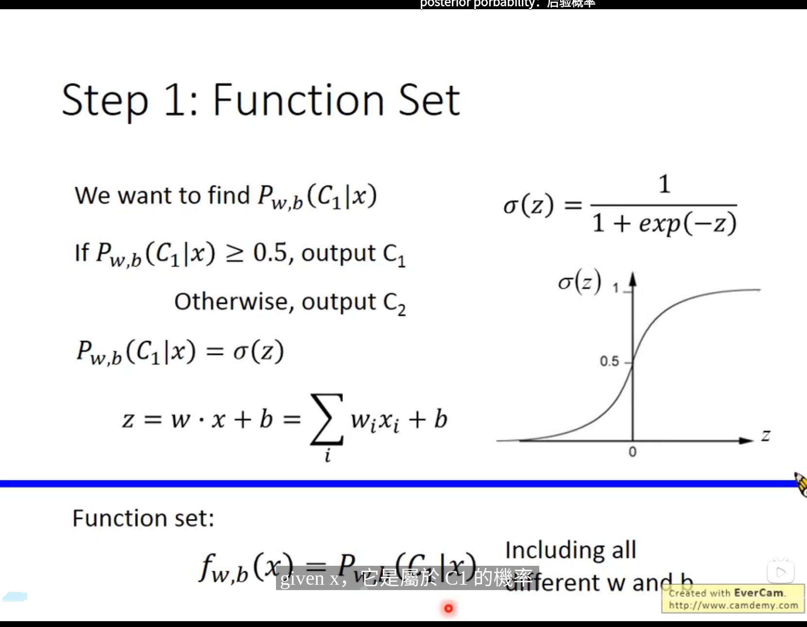

<!--
 * @Author: hedaobaishui 896585355@qq.com
 * @Date: 2022-04-18 16:39:03
 * @LastEditors: hedaobaishui 896585355@qq.com
 * @LastEditTime: 2022-09-03 09:35:52
 * @FilePath: /2021_9_23/home/magic/AKApractice/akaNotes/DL/0常见机器学习算法.md
 * @Description: 这是默认设置,请设置 `customMade`, 打开koroFileHeader查看配置 进行设置: https://github.com/OBKoro1/koro1FileHeader/wiki/%E9%85%8D%E7%BD%AE
-->
<!-- TOC -->

- [0、算法分析](#0算法分析)
  - [0.1 loss 分析](#01-loss-分析)
- [1、常见基础算法](#1常见基础算法)
  - [1.1　卡尔曼滤波](#11卡尔曼滤波)
  - [1.2 匈牙利算法](#12-匈牙利算法)
- 
  - [1.1 目标检测](#11-目标检测)
- [1 deep sort](#1-deep-sort)
- [1.1 卡尔曼滤波器](#11-卡尔曼滤波器)
- [2 极大似然估计](#2-极大似然估计)
- [3 逻辑回归](#3-逻辑回归)
- [4 discriminative vs Generative](#4-discriminative-vs-generative)
- [5 朴素贝叶斯模型－－naive biyes 典型的生成式模型](#5-朴素贝叶斯模型naive-biyes-典型的生成式模型)

<!-- /TOC -->
# 0、算法分析
## 0.1 loss 分析

# 1、常见基础算法
## 1.1　卡尔曼滤波
适用于线性高斯系统
线性　= 叠加性 + 齐次性
叠加性：f(a+b) = f(a)+f(b)
用上一次的最优结果预测当前的值，同时使用观测值修正当前值，得到最优结果。
齐次性：f(kx) = kf(x)
*预测*： 

$\hat{x}_t^- = F\hat{x}_{t-1}+Bu_{t-1}$ 　　先验估计(状态方程　u　输入)$\hat{x}_{t-1}$最优估计值后验估计值

$P_t^- = FP_{t-1}F^T+Q$　　协方差公式

*更新*

$K_t = P_t^-H^T(HP_t^-+R)$　H 观测矩阵由观测和状态的关系决定H是测量状态量的权值矩阵

$\hat{x}_t = \hat{x}^- + K_t(Z_t-Hx_t^-)$　　Ｋ:卡尔曼增益

$P_t=(I－K_tH)P_t^-$

R 测量噪声　Q 过程\状态噪声(与假设模型存在的方差)协方差矩阵
## 1.2 匈牙利算法
    指派问题
    匈牙利算法
    目标函数最小　效率非负　人数和项目相等
    　
# 
## 1.1 目标检测
# 1 deep sort
# 1.1 卡尔曼滤波器
# 2 极大似然估计
maximum likelihood  
- 使得样本出现概率最大时对参数的估计

# 3 逻辑回归
- 需要线性可分
计算方式：
- 求解wi 和ｂ,
- 使用极大似然估计求解
- 引入了交叉熵的概念　估计　$f_{w,b}(x)$ 和ｙ的分布    

# 4 discriminative vs Generative

- discriminative　不做先验假设
* Generative 
  - 假设先验分布　比如高斯分布　
  - 统计学概念　样本为抽样值，通过抽样值估计分布　使用最大似然估计

- 判别式模型
  由数据直接学习 $P(y|x)$来预测y yy，
- 生成式模型
  学习每个类别对应的分布$P(x|y)$和$P(y)$（也就是联合概率$P(x,y)$，$P(x,y)=P(x|y)P(y)$）。
  
  用个通俗易懂的例子来解释下（摘自ng：Generative Learning algorithms），假如我们的任务是个二分类任务，要算法根据训练数据判断出是大象（label=0）还是狗（label=1），判别式模式直接对P ( y ∣ x ) P(y|x)P(y∣x)建模，学习的是大象和狗之间的区别（Machine Learning: Generative and Discriminative Models，p10）。而生成式模型则分别对大象建模 P ( x ∣ y = 0 ) P(x|y=0)P(x∣y=0)和对狗建模P ( x ∣ y = 1 ） P(x|y=1）P(x∣y=1），也就是用一个模型来刻画大象，再用另一个模型来刻画狗。来了一个新样本后，它去分别和大象和狗的模型进行匹配，看看更像哪一个，则把新样本分为哪一类。也就是说，生成式模型实际上是建立一个多模型（有多少类就建多少个模型），而判别式模型只有一个模型。

  这两种方法各有优缺点，判别模型可以简化学习问题，由于直接面对预测，往往学习的准确率更高（判别式模型性能通常较好，这一点在Ng和Jordan的论文的论文中也说明了，论文：On Discriminative vs. Generative classifiers: A comparison of logistic regression and naive Bayes ）这一篇文章是一篇很经典的阐述判别式模型和生成式模型的论文），而生成式模型的学习收敛速度更快，当样本数量增加的时候，学到的模型可以更快的收敛于真实模型。而且可以学习有因变量的任务，比如隐马尔科夫模型。
# 5 朴素贝叶斯模型－－naive biyes 典型的生成式模型

image.png
