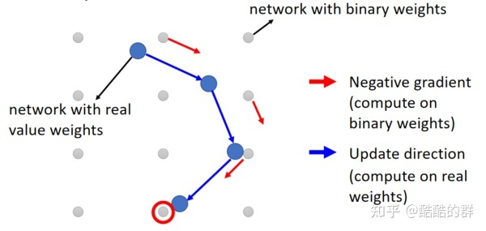

<!--
 * @Author: hedaobaishui 896585355@qq.com
 * @Date: 2022-04-27 22:31:48
 * @LastEditors: hedaobaishui 896585355@qq.com
 * @LastEditTime: 2022-07-12 13:46:15
 * @FilePath: /TaiDL/home/magic/AKApractice/akaNotes/DL/1边缘计算.md
 * @Description: 这是默认设置,请设置`customMade`, 打开koroFileHeader查看配置 进行设置: https://github.com/OBKoro1/koro1FileHeader/wiki/%E9%85%8D%E7%BD%AE
-->
<!-- TOC -->

- [0.边缘计算定义](#0边缘计算定义)
- [1. 轻量模型](#1-轻量模型)
- [2. 模型量化](#2-模型量化)
- [3. 模型移植](#3-模型移植)
- [4. 模型压缩](#4-模型压缩)
  - [4.1 网络减枝](#41-网络减枝)
  - [4.2 知识蒸馏](#42-知识蒸馏)
  - [4.3 参数量化（Parameter Quantization）](#43-参数量化parameter-quantization)
  - [4.4 结构设计](#44-结构设计)
  - [4.5 动态计算（Dynamic Computation）](#45-动态计算dynamic-computation)
  - [4.6 NAS 网络结构搜索](#46-nas-网络结构搜索)

<!-- /TOC -->

# 0.边缘计算定义
`边缘计算，是指在靠近物或数据源头的一侧，采用网络、计算、存储、应用核心能力为一体的开放平台，就近提供最近端服务。其应用程序在边缘侧发起，产生更快的网络服务响应，满足行业在实时业务、应用智能、安全与隐私保护等方面的基本需求。边缘计算处于物理实体和工业连接之间，或处于物理实体的顶端。而云端计算，仍然可以访问边缘计算的历史数据.`
# 1. 轻量模型
　见[深度学习经典模型－－轻量模型](./3%E6%B7%B1%E5%BA%A6%E5%AD%A6%E4%B9%A0%E7%BB%8F%E5%85%B8%E6%A8%A1%E5%9E%8B.md)
# 2. 模型量化
# 3. 模型移植
# 4. 模型压缩
[参考网址](https://blog.csdn.net/nature553863/article/details/81083955?utm_medium=distribute.pc_feed_404.none-task-blog-2~default~BlogCommendFromBaidu~Rate-9-81083955-blog-null.pc_404_mixedpudn&depth_1-utm_source=distribute.pc_feed_404.none-task-blog-2~default~BlogCommendFromBaidu~Rate-9-81083955-blog-null.pc_404_mixedpud)
## 4.1 网络减枝
* 而使用Neuron pruning就不会遇到上述问题，Neuron pruning后的网络结构仍然是规则的，因此仍然可以使用GPU进行加速。
* weight pruning 然后使用不同GPU加速发现加速效果并不好，这是因为剪枝做成了网络结构的不规则，因此难以用GPU进行加速。
## 4.2 知识蒸馏
## 4.3 参数量化（Parameter Quantization）
* 使用更少的bits来表示一个参数，比如将64位浮点数换成32位浮点数。
* 权重聚类（Weight Clustering）我们可以使用聚类算法（如K-Means）来将权重进行聚类，然后每个权重就只需要存储对应的类别，比如下图中聚成了四类则每个权重只需要2个bit就可以存储，另外还需要存储四类的值，每个值都是该类中所有参数的平均值.类似哈希存储

* 用更少的bit表示频繁出现的类别，用较多的bit来表示出现较少的类别。例如使用哈弗曼编码（Huffman encoding）。
* 使用二进制参数（Binary Weights），使用Binary Connect的方式训练神经网络，下图代表参数空间，灰色点代表二进制的一组参数，更新梯度时计算离当前参数最近的二进制参数的梯度然后进行梯度下降，最终的结果也是取距离最近的一组二进制参数
  
## 4.4 结构设计
* 网络结构上优化　类似深度可分离网络mobilenet
* 分组卷积

## 4.5 动态计算（Dynamic Computation）
* 根据平台　在网络的不同层输出

## 4.6 NAS 网络结构搜索
使用什么方法搜索
如何做到收敛
收敛的判断方式
是否需要训练

[参考网址](https://cloud.tencent.com/developer/article/1831107)
