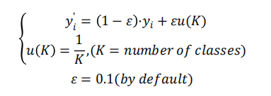
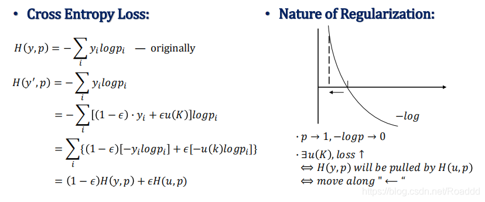

<!-- TOC -->autoauto- [0 工程目标](#0-工程目标)auto    - [0.1](#01)auto    - [0.2](#02)auto- [1 数据集准备](#1-数据集准备)auto    - [1.1 torchvision.datasets 和　torch.utils.data.dataset 区别](#11-torchvisiondatasets-和　torchutilsdatadataset-区别)auto    - [1.2 torchvision.datasets 和　torch.utils.data.dataloader 区别](#12-torchvisiondatasets-和　torchutilsdatadataloader-区别)auto- [2.损失函数](#2损失函数)auto    - [2.1](#21)auto- [3.卷积网络](#3卷积网络)auto    - [3.0 基础知识](#30-基础知识)auto    - [3.1 网络初始化](#31-网络初始化)auto    - [3.2 前向传播](#32-前向传播)auto- [4.模型训练](#4模型训练)auto- [6.保存快照　checkpoint](#6保存快照　checkpoint)auto    - [6.1 仅保存模型](#61-仅保存模型)auto    - [6.2保存训练过程数据](#62保存训练过程数据)auto- [7、　训练trick](#7　训练trick)auto    - [7.1. batchsize对训练结果的影响选择](#71-batchsize对训练结果的影响选择)auto    - [7.2 label smoothing](#72-label-smoothing)auto- [torchviz](#torchviz)auto- [8.训练过程记录](#8训练过程记录)autoauto<!-- /TOC -->
# 0 工程目标
## 0.1 
## 0.2
模型搭建基本流程的
数据集迭代器、模型网络、优化器、学习率、日志、模型保存
# 1 数据集准备
## 1.1 torchvision.datasets 和　torch.utils.data.dataset 区别
*  torchvision 
## 1.2 torchvision.datasets 和　torch.utils.data.dataloader 区别
* torchvision 集成了很多经典的模型和torch工具
* 使用torchvision.datasets.ImageFolder可以直接打开文件夹的数据
* (主要读取的是图片数据（按文件夹分好的类）而且没有标签数据)，若要自己定义数据的读取方式　则需要重写Dataset类
  

    `
traindataset = ImageFolder(traindatadir,transform.compose([(),（）])，batch_size=32,shuffle=True,num_workers=10,
pin_memory=True,)
    `

    然后就可以使用迭代器处理数据了
* torch.utils.data.Dataset\Dataloader
  
  **1.先使用Dataset 生成数据的读取和预处理方式。**

  主要重写两个函数：
  
  `
  __getitem__() __len__()
  `
  >__getitem__(index) 主要用于获得序号为index的数据。index为使用迭代器时传入的数据
  >__len__() 获得全部数据的数量

  **2.使用Dataloader生成数据的迭代方式**
  
  `
   traindata = Dataloader(batch_size=32,shuffle=True,num_workers=10,
    pin_memory=True,) 
  `
  
# 2.损失函数
## 2.1

# 3.卷积网络
## 3.0 基础知识
  * nn.xx 和 nn.functional.xx区别
  
    - 相同之处
    
        实际功能相同、运行效率也近乎相同
    + 不同之处
        * 1. 前者是后者的类封装
        * 2. 前者需要先实例化并传入数据，后者可以直接调用但需要传入weights和bias、数据等参数
        * 3. 前者可以和nn.Sequential()结合使用　
        * 4. 具有学习参数的使用前者，没有的使用后者对于dropout 建议使用nn.XX
  
  
## 3.1 网络初始化
## 3.2 前向传播
    要重写forward(self,x)函数

# 4.模型训练
  ## 4.1 参数初始化
    卷积层初始化 Batchnormal 初始化
    nn.init.{normal方法}
```
    for m in model.modules():
      if isinstance(m,(nn.Conv2d,nn.Linear))
        nn.init.kaiming_normal_(m.weight,mode='fan_in')
      if isinstance(m, nn.BatchNorm2d):
        nn.init.constant(m.weight, 1)
        nn.init.constant(m.bias, 0)
```
方法二：
组合model.apply(function) #apply函数会递归地搜索网络内的所有module并把参数表示的函数应用到所有的module上。
```
    classname = m.__class__.__name__
    if classname.find('Conv') != -1:
        nn.init.normal_(m.weight.data, 0.0, 0.02)
    elif classname.find('BatchNorm') != -1:
        nn.init.normal_(m.weight.data, 1.0, 0.02)
        nn.init.constant_(m.bias.data, 0)
```
    

  ## 4.2 损失函数\不同的交叉熵
    criterion = nn.{交叉熵函数}
    二分类　多分类　l1 l2 KL散度等等
    使用：
    loss = criterion(modelout,truelable)
  ## 4.3 选择优化器
    Optim = torch.optim.{优化器}.{模型参数(model.parameters())，优化器参数}　Adam　SGD　Rprop 等等
**使用** ：

    Optim.zero_grad() ＃清除之前的每个参数梯度值　防止梯度累积
    loss.backward() # 产生梯度值　
    Optim.step()　# 更新参数值
  ## 4.4 学习率
  lr_scheduler = torch.optim.lr_scheduler.{优化器}.{优化器参数}
  
  使用：
```
  for step in range(epochs):
    train()
    val()
    lr_scheduler.step() #注意是每一次迭代后更新一下
```
# 6.保存快照　checkpoint
## 6.1 仅保存模型
model.state_dict():
返回一个包含模型状态信息的字典。包含参数（weighs and biases）和持续的缓冲值（如：观测值的平均值）。只有具有可更新参数的层才会被保存在模型的 state_dict 数据结构中。

**保存**
```
torch.save(model,Path) # Path命名　.pth .pt
# 只保存模型参数　　速度快占用空间少
torch.save(model.state_dict(),Path) # Path命名　.pth .pt

```
**加载**
```
model.load_state_dict(torch.load(modelPath)) # Path命名　.pth .pt
```
## 6.2保存训练过程数据
**保存**
```
torch.save(torch.save({
'epoch': epoch,
'model_state_dict': model.state_dict(),
'optimizer_state_dict': optimizer.state_dict(),
'loss': loss,
...},modelpath) # modelpath 可以用checkpoint.pth.tar命名
```
**加载**
```
model = TheModelClass(*args, **kwargs)
optimizer = TheOptimizerClass(*args, **kwargs)
checkpoint = torch.load(PATH)
model.load_state_dict(checkpoint['model_state_dict'])
optimizer.load_state_dict(checkpoint['optimizer_state_dict'])
epoch = checkpoint['epoch']
loss = checkpoint['loss']
model.eval()
model.train()
```
# 7、　训练trick

## 7.1. batchsize对训练结果的影响选择
[参考文献](https://zhuanlan.zhihu.com/p/52801123)

## 7.2 label smoothing
 Label Smoothing（标签平滑），像 L1、L2 和 Dropout 一样，是一种正则化方法，通常用于分类问题，目的是防止模型在训练时过于自信地预测标签，
 改善泛化能力差的问题（也是解决错误标注的一种方法）。





通俗理解：这个平滑就是一定程度缩小 label 中 min 和 max 的差距，label 平滑可以减 小过拟合，深度学习中的 Loss 实际上就是鼓励模型去接近对应的 label，越接近 Loss 越小。 但是这样真的好吗？或者说，是不是有点过了，尤其针对像交叉熵这类 Loss，一旦 output 有些偏差，Loss 值就往无穷大去了，就逼迫模型去接近真实的 label。万一好不容易接近 label 了，结果这条 training data 还是错的（是很有可能的），或者 training data 并没有完整覆盖所 有类型，那就必须过拟合了。所以，适当调整 label，让两端的极值往中间凑，可以增加泛 化能力。


# torchviz
# 8.训练过程记录
wandb
tensorboard
tqdm
Pathlib
