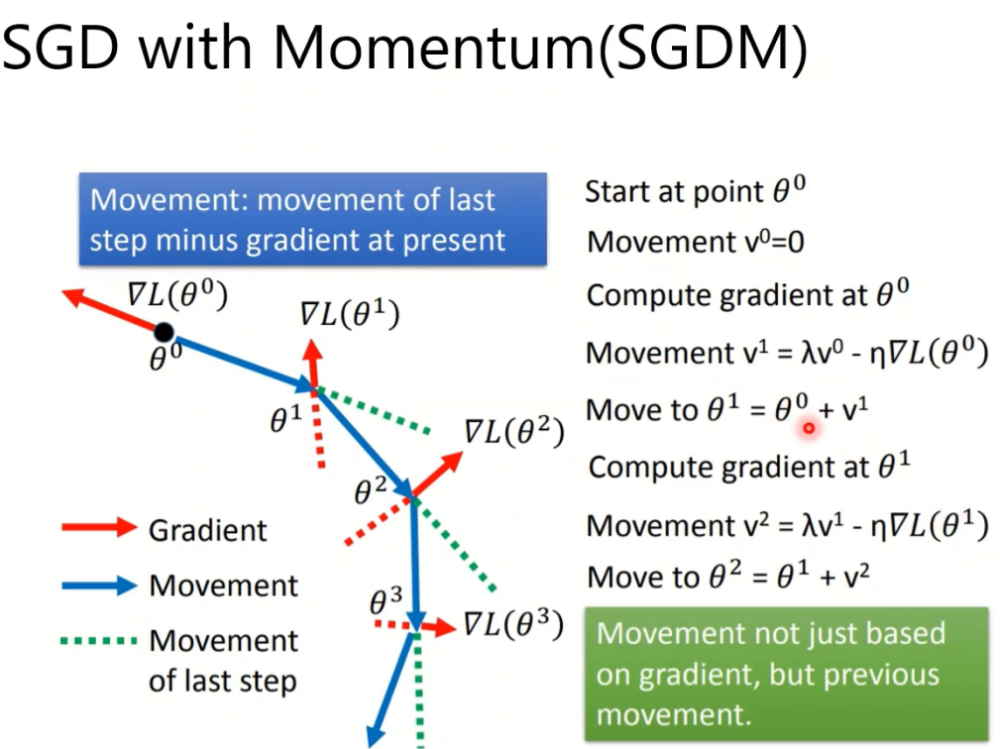

<!-- TOC -->

- [1. 工程目标](#1-工程目标)
  - [1.1.](#11)
  - [1.2. 2](#12-2)
- [2. 数据集准备](#2-数据集准备)
  - [2.1. torchvision.datasets 和　torch.utils.data.dataset 区别](#21-torchvisiondatasets-和torchutilsdatadataset-区别)
- [3. 损失函数](#3-损失函数)
  - [3.1. 不同的　Loss](#31-不同的loss)
- [4. 卷积网络](#4-卷积网络)
  - [4.1. 基础知识](#41-基础知识)
  - [4.2. 网络初始化](#42-网络初始化)
  - [4.3. 前向传播](#43-前向传播)
- [5. 模型训练](#5-模型训练)
  - [4.1 参数初始化](#41-参数初始化)
  - [4.2 损失函数\不同的交叉熵](#42-损失函数不同的交叉熵)
  - [4.3 选择优化器](#43-选择优化器)
- [4.3.1 伪代码](#431-伪代码)
- [4.3.2 优化函数](#432-优化函数)
  - [4.4 学习率](#44-学习率)
- [6. 学习策略](#6-学习策略)
  - [6.1. CosineAnnealingLR](#61-cosineannealinglr)
  - [6.2. CosineAnnealingWarmRestarts](#62-cosineannealingwarmrestarts)
  - [6.3. warm up](#63-warm-up)
- [7. 保存快照　checkpoint](#7-保存快照checkpoint)
  - [7.1. 仅保存模型](#71-仅保存模型)
  - [7.2. 保存训练过程数据](#72-保存训练过程数据)
- [8. 训练trick](#8-训练trick)
- [8.0 提高模型性能](#80-提高模型性能)
  - [8.1. batchsize对训练结果的影响选择](#81-batchsize对训练结果的影响选择)
  - [8.2. label smoothing](#82-label-smoothing)
- [9. torchviz](#9-torchviz)
- [10. 训练过程记录](#10-训练过程记录)

<!-- /TOC -->
# 1. 工程目标
## 1.1.  
## 1.2. 2
模型搭建基本流程的
数据集迭代器、模型网络、优化器、学习率、日志、模型保存
# 2. 数据集准备
## 2.1. torchvision.datasets 和　torch.utils.data.dataset 区别
* torchvision 
  torchvision 集成了很多经典的模型和torch工具
  使用torchvision.datasets.ImageFolder可以直接打开文件夹的数据
  (主要读取的是图片数据（按文件夹分好的类）而且没有标签数据)，
  可以通过重写__getitem__() 类重新定义自己打开数据的方式
　可以直接使用　trainloader = ImageFolder(rootpath,....)　生成data loader 使用默认的PIL 读取数据
　也可以重写__getitem__()　来自定义数据的读取方式
　DatasetFolder 没有定义数据的读取方式，是一个参数　需要自己定义

``` 
    train_dataset = datasets.ImageFolder(
        traindir,
        transforms.Compose([
            transforms.RandomResizedCrop(config.MODEL.IMAGE_SIZE[0]),
            transforms.RandomHorizontalFlip(),
            transforms.ToTensor(),
            normalize,
        ])
    )
    train_loader = torch.utils.data.DataLoader(
        train_dataset,
        batch_size=config.TRAIN.BATCH_SIZE_PER_GPU * len(gpus),
        shuffle=True,
        num_workers=config.WORKERS,
        pin_memory=True
    )
```

* torch.utils.data.dataloader \dataset 区别
  1. Dataset类　可以Mydataset自己定义　数据的处理方式　包括重新定义　＿＿getitem__() 和__len__()类(必须)　和其他的数据处理函数,然后然后就可以使用迭代器处理数据了
  2. 使用Dataloader()　生成数据加载器
      trainloader = Dataloader(Mydataset,batchsize.....)
      [参考](
    https://github.com/ultralytics/yolov3/blob/b3244d05cdb1934df47fee53b6f5b99b43fcf99b/utils/datasets.py#L377)

# 3. 损失函数
## 3.1. 不同的　Loss
 

# 4. 卷积网络
## 4.1. 基础知识
  * nn.xx 和 nn.functional.xx区别
  
    - 相同之处
    
        实际功能相同、运行效率也近乎相同
    + 不同之处
        * 1. 前者是后者的类封装
        * 2. 前者需要先实例化并传入数据，后者可以直接调用但需要传入weights和bias、数据等参数
        * 3. 前者可以和nn.Sequential()结合使用　
        * 4. 具有学习参数的使用前者，没有的使用后者对于dropout 建议使用nn.XX
  
  
## 4.2. 网络初始化
## 4.3. 前向传播
    要重写forward(self,x)函数

# 5. 模型训练
  ## 4.1 参数初始化
    卷积层初始化 Batchnormal 初始化
    nn.init.{normal方法}
```
    for m in model.modules():
      if isinstance(m,(nn.Conv2d,nn.Linear))
        nn.init.kaiming_normal_(m.weight,mode='fan_in')
      if isinstance(m, nn.BatchNorm2d):
        nn.init.constant(m.weight, 1)
        nn.init.constant(m.bias, 0)
```
方法二：
组合model.apply(function) #apply函数会递归地搜索网络内的所有module并把参数表示的函数应用到所有的module上。
```
    classname = m.__class__.__name__
    if classname.find('Conv') != -1:
        nn.init.normal_(m.weight.data, 0.0, 0.02)
    elif classname.find('BatchNorm') != -1:
        nn.init.normal_(m.weight.data, 1.0, 0.02)
        nn.init.constant_(m.bias.data, 0)
```
    

  ## 4.2 损失函数\不同的交叉熵
    criterion = nn.{交叉熵函数}
    二分类　多分类　l1 l2 KL散度等等
    使用：
    loss = criterion(modelout,truelable)
  ## 4.3 选择优化器
  # 4.3.1 伪代码
    Optim = torch.optim.{优化器}.{模型参数(model.parameters())，优化器参数}　Adam　SGD　Rprop 等等
**使用** ：

    Optim.zero_grad() ＃清除之前的每个参数梯度值　防止梯度累积
    loss.backward() # 产生梯度值　
    Optim.step()　# 更新参数值
  # 4.3.2 优化函数
*  SGD  

*  Adagrad－－－考虑了历史的值  

*  RMSprop－－－　改进Adagrad　累计的历史值太大  

*  Adam－－－综合了SGDM　和　RMSprop 即考虑了历史值又结合了当下的动量  
  
*  AdamW－－－考虑了L2正则化  


*  Nesterov --　动量的变种  
  1.Nesterov是Momentum的变种。
  2.与Momentum唯一区别就是，计算梯度的不同，Nesterov先用当前的速度v更新一遍参数，在用更新的临时参数计算梯度。
  3.相当于添加了矫正因子的Momentum。
  4.在GD下，Nesterov将误差收敛从O（1/k），改进到O(1/k^2)
  5.然而在SGD下，Nesterov并没有任何改进  


  ## 4.4 学习率　
  lr_scheduler = torch.optim.lr_scheduler.{优化器}.{优化器参数}
  
  使用：
```
  for step in range(epochs):
    train()
    val()
    lr_scheduler.step() #注意是每一次迭代后更新一下
```


# 6. 学习策略 
## 6.1. CosineAnnealingLR
[余弦退火](../0picture/cosinannealingLR.png)

## 6.2. CosineAnnealingWarmRestarts


## 6.3. warm up
  warmup顾名思义就是热身，在刚刚开始训练时以很小的学习率进行训练，使得网络熟悉数据，随着训练的进行学习率慢慢变大，到了一定程度，以设置的初始学习率进行训练，接着过了一些inter后，学习率再慢慢变小；学习率变化：上升——平稳——下降；

具体步骤：

  启用warm up，设置warm up setp（一般等于epoch*inter_per_epoch），当step小于warm up setp时，学习率等于基础学习率×(当前step/warmup_step)，由于后者是一个小于1的数值，因此在整个warm up的过程中，学习率是一个递增的过程！当warm up结束后，学习率以基础学习率进行训练，然后学习率开始递减

# 7. 保存快照　checkpoint
## 7.1. 仅保存模型
model.state_dict():
返回一个包含模型状态信息的字典。包含参数（weighs and biases）和持续的缓冲值（如：观测值的平均值）。只有具有可更新参数的层才会被保存在模型的 state_dict 数据结构中。

**保存**
```
torch.save(model,Path) # Path命名　.pth .pt
# 只保存模型参数　　速度快占用空间少
torch.save(model.state_dict(),Path) # Path命名　.pth .pt

```
**加载**
```
model.load_state_dict(torch.load(modelPath)) # Path命名　.pth .pt
```
## 7.2. 保存训练过程数据
**保存**
```
torch.save(torch.save({
'epoch': epoch,
'model_state_dict': model.state_dict(),
'optimizer_state_dict': optimizer.state_dict(),
'loss': loss,
...},modelpath) # modelpath 可以用checkpoint.pth.tar命名
```
**加载**
```
model = TheModelClass(*args, **kwargs)
optimizer = TheOptimizerClass(*args, **kwargs)
checkpoint = torch.load(PATH)
model.load_state_dict(checkpoint['model_state_dict'])
optimizer.load_state_dict(checkpoint['optimizer_state_dict'])
epoch = checkpoint['epoch']
loss = checkpoint['loss']
model.eval()
model.train()
```
# 8. 训练trick
# 8.0 提高模型性能
* shuffling
* dropout
* Gradient noise 梯度增加噪声
* Warm up
* Curriculum learning
  先用容易训练的数据训练　再用困难的数据训练
* Fine-tuning
* 归一化　不同通道的归一化
* 正则化
## 8.1. batchsize对训练结果的影响选择
[参考文献](https://zhuanlan.zhihu.com/p/52801123)

## 8.2. label smoothing
 Label Smoothing（标签平滑），像 L1、L2 和 Dropout 一样，是一种正则化方法，通常用于分类问题，目的是防止模型在训练时过于自信地预测标签，
 改善泛化能力差的问题（也是解决错误标注的一种方法）。


通俗理解：这个平滑就是一定程度缩小 label 中 min 和 max 的差距，label 平滑可以减 小过拟合，深度学习中的 Loss 实际上就是鼓励模型去接近对应的 label，越接近 Loss 越小。 但是这样真的好吗？或者说，是不是有点过了，尤其针对像交叉熵这类 Loss，一旦 output 有些偏差，Loss 值就往无穷大去了，就逼迫模型去接近真实的 label。万一好不容易接近 label 了，结果这条 training data 还是错的（是很有可能的），或者 training data 并没有完整覆盖所 有类型，那就必须过拟合了。所以，适当调整 label，让两端的极值往中间凑，可以增加泛 化能力。


# 9. torchviz
# 10. 训练过程记录
wandb
tensorboard
tqdm
Pathlib
