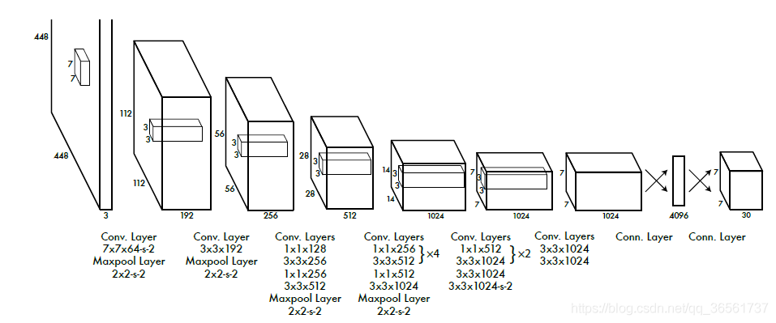
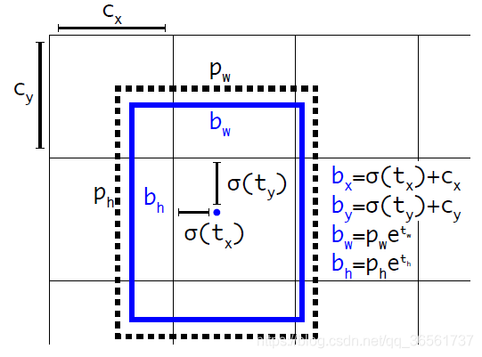
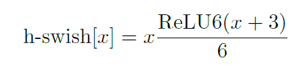
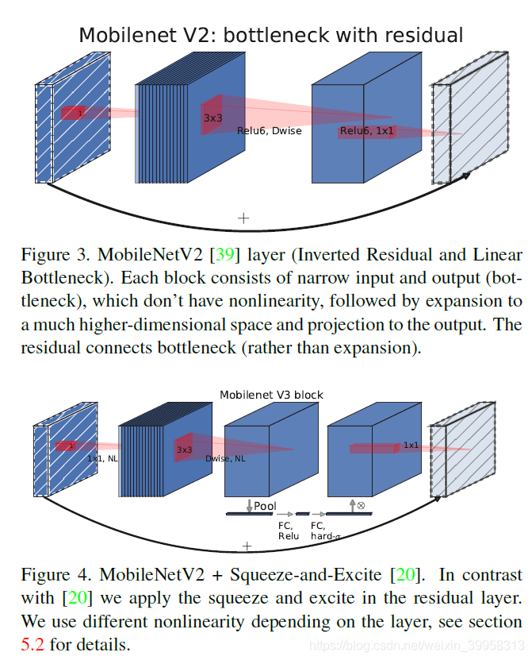

<!--
 * @Author: hedaobaishui 896585355@qq.com
 * @Date: 2022-04-11 15:15:56
 * @LastEditors: hedaobaishui 896585355@qq.com
 * @LastEditTime: 2022-09-02 21:21:07
 * @FilePath: /cavaface-master/home/magic/AKApractice/akaNotes/DL/3深度学习经典模型.md
 * @Description: 这是默认设置,请设置`customMade`, 打开koroFileHeader查看配置 进行设置: https://github.com/OBKoro1/koro1FileHeader/wiki/%E9%85%8D%E7%BD%AE
-->
<!-- TOC -->

- [1. 基础知识](#1-基础知识)
- [2. 目标检测](#2-目标检测)
    - [2.1 one-stage](#21-one-stage)
        - [2.1.1 YOLO 家族](#211-yolo-家族)
            - [2.1.1.1 yolov1](#2111-yolov1)
            - [2.1.1.2 yolov2](#2112-yolov2)
            - [2.1.1.3 yolov3](#2113-yolov3)
            - [2.1.1.4 yolov4](#2114-yolov4)
            - [2.1.1.5 yolov5](#2115-yolov5)
            - [2.1.1.6 yoloX](#2116-yolox)
            - [2.1.1.7 TOOD](#2117-tood)
    - [2.2 two-stage](#22-two-stage)
- [3.　跟踪算法](#3　跟踪算法)
- [2.deepsort((2022.4.27~2022.5.5))](#2deepsort2022427202255)
- [2.deepsort((2022.4.27~2022.5.5))](#2deepsort2022427202255-1)
- [4. 图像分割](#4-图像分割)
- [5. 6DOF](#5-6dof)
- [6. 点云](#6-点云)
- [7. SLAM](#7-slam)
- [8. GAN](#8-gan)
- [9. transform](#9-transform)
- [10. 轻量模型](#10-轻量模型)
    - [10.1 Mobilenet](#101-mobilenet)
        - [*v1*](#v1)
        - [*v2*](#v2)
        - [*v3*](#v3)
    - [10.2 ghostNet](#102-ghostnet)

<!-- /TOC -->
# 1. 基础知识
 ## 1.0 Battleneck layer（瓶颈层）
 Bottleneck layer又称之为瓶颈层，使用的是1*1的卷积神经网络。之所以称之为瓶颈层，是因为长得比较像一个瓶颈。
 我们看到，使用 **1X1** 的网络结构很方便改变维度。灵活设计网络，并且减小计算量
 
 ## 1.1Linear Bottleneck 
 来源　MobileNetV2
 使用的深度可分离卷积
 
 $$\mathcal{U}(-\sqrt{k}, \sqrt{k})$$
 ## 1.2 backbone
 ## 1.3 timm  
 ```Pytorch Image Models (timm) 整合了常用的models, layers, utilities, optimizers, schedulers, data-loaders / augmentations, and reference training / validation scripts，它的目的是将各种SOTA模型整合在一起，并具有再现ImageNet训练结果的能力。```
# 2. 目标检测
## 2.1 one-stage
### 2.1.1 YOLO 家族
[参考网址](https://blog.csdn.net/qq_36561737/article/details/115711354)
#### 2.1.1.1 yolov1


* 训练
  数据处理 & 目标框预处理 [代码参考](https://github.com/yjh0410/new-YOLOv1_PyTorch)
  - 坐标转换　：根据输入的图像大小，下采样的大小stride计算在特征图上的loc
  ```python
  def generate_dxdywh(gt_label, w, h, s):
    xmin, ymin, xmax, ymax = gt_label[:-1]
    # compute the center, width and height
    c_x = (xmax + xmin) / 2 * w
    c_y = (ymax + ymin) / 2 * h
    box_w = (xmax - xmin) * w
    box_h = (ymax - ymin) * h

    if box_w < 1. or box_h < 1.:
        # print('A dirty data !!!')
        return False    

    # map center point of box to the grid cell
    c_x_s = c_x / s
    c_y_s = c_y / s
    grid_x = int(c_x_s)
    grid_y = int(c_y_s)
    # compute the (x, y, w, h) for the corresponding grid cell
    tx = c_x_s - grid_x
    ty = c_y_s - grid_y
    tw = np.log(box_w)
    th = np.log(box_h)
    weight = 2.0 - (box_w / w) * (box_h / h)

    return grid_x, grid_y, tx, ty, tw, th, weight
  ```
  - 置信度 ：　映射到特征图上的方框的中心点的置信度为1
  ```python
  def gt_creator(input_size, stride, label_lists=[], name='VOC'):
    assert len(input_size) > 0 and len(label_lists) > 0
    # prepare the all empty gt datas
    batch_size = len(label_lists)
    w = input_size[1]
    h = input_size[0]
    
    # We  make gt labels by anchor-free method and anchor-based method.
    ws = w // stride
    hs = h // stride
    s = stride
    gt_tensor = np.zeros([batch_size, hs, ws, 1+1+4+1])

    # generate gt whose style is yolo-v1
    for batch_index in range(batch_size):
        for gt_label in label_lists[batch_index]:
            gt_class = int(gt_label[-1])
            result = generate_dxdywh(gt_label, w, h, s)
            if result:
                grid_x, grid_y, tx, ty, tw, th, weight = result

                if grid_x < gt_tensor.shape[2] and grid_y < gt_tensor.shape[1]:
                    gt_tensor[batch_index, grid_y, grid_x, 0] = 1.0
                    gt_tensor[batch_index, grid_y, grid_x, 1] = gt_class
                    gt_tensor[batch_index, grid_y, grid_x, 2:6] = np.array([tx, ty, tw, th])
                    gt_tensor[batch_index, grid_y, grid_x, 6] = weight


    gt_tensor = gt_tensor.reshape(batch_size, -1, 1+1+4+1)

    return gt_tensor
    ```
* 缺点
  (1)每个cell只能预测一个类别和几个框；
  (2)对于小目标检测效果不好；
  (3)用全连接层预测丢失了位置信息；
  (4)只能检测与训练时固定尺度的图像(后面全连接层的限制)。


- 推理
坐标都是相对图像H W 的缩放　x1,y1,x2,y2
https://github.com/yjh0410/new-YOLOv1_PyTorch/blob/f28ecc68f9a9f1a91ab14ecc31fa36d586456f7b/train.py#L243
#### 2.1.1.2 yolov2
* 改进:
  (1)Batch Normalization  
  BN可以对每一层输出的特征进行归一化，提高模型的鲁棒性。在每一层Conv之后加上BN可以涨2个点。去掉全连接层，改成全卷积
  (2)High Resolution Classifier  
  采用更高分辨率的图像作为输入。YOLO v1输入224，这里输入448进行微调，可以提高4个点。  
  (3)Convolutional With Anchor Boxes  
  移除后面的FC层，引入Anchor预测目标与Ground Truth的偏差，输入416×416，stride=32输出特征13×13。YOLO v1只能预测98个目标，引入anchor之后可以预测上千个，mAP下降0.3，但是召回率明显提高。  
  (4)Dimension Clusters  
  引入anchor时，用k-means聚类的方式找到合适的anchor尺度和比例，避免手工设计的不足。具体思想是利用ground truth和anchor的IoU进行聚类，避免目标尺度大小的影响。最终聚类之后每个位置5个anchor可以达到9个anchor的性能。  
  (5)Direct location prediction  
  利用Anchor进行训练时，预测中心点与长宽的偏差，刚开始训练时没有约束会导致训练不稳定。因此，将预测边框的中心约束固定在特定的网格内，即对中心点的预测利用Sigmoid进行处理。涨５个点.
  
  (6)Fine-Grained Features  
  由于图像中目标大小不一，经过下采样过后小目标可能会丢失。这里提出passthrough，即在最后特征经过pooling之前，先将特征图进行拆成4份，然后将其与pooling之后的特征进行通道维度的拼接。涨1个点。  
  (7)Multi-Scale Training  
  多尺度训练，在320-608之间中随机选择32的倍数作为训练尺度，以适应不同尺度的目标大小。最后以512尺度进行测试，可以达到78.6mAP
  (8) 改进了网络结构　使用darknet19
#### 2.1.1.3 yolov3
* 改进  
  (1). 网络结构darknet-53 加入了残差机制  
  (2). FPN  
  YOLO v3这里采用FPN自顶向下的特征融合结构，用于融合的三层特征尺度分别是32×32×256、16×16×512、8×8×512，特征融合时采用concat的方式(区别于Resnet相加的结构)，最终用于检测的特征尺度是32×32×255、16×16×255、8×8×255。小尺度特征上采样时采用最近邻插值的方式实现。  
  (3).检测头  
  最终输出的通道数是255，即W×H×[3×(4+1+80)]，其中3表示三种anchor尺度(仍然采用YOLO v2的方案进行K-means聚类实现的)，4表示(x,y,w,h)，1表示score，80表示coco数据集的所有类别.  
  (4) 损失函数  
  损失函数仍然是分类损失+回归损失，其中分类损失采用Sigmoid替代了YOLO v2中的Softmax，更加灵活并且避免了类间互斥(YOLO v2用Softmax是同一类别层级的)。  
  (5) 样本筛选策略  
  正样本即为anchor与目标的最大IoU的(即使IoU没有大于阈值)，并且每个anchor唯一匹配一个ground truth；忽略样本即为IoU大于阈值的，但是不是正样本的;负样本即为IoU小于阈值并且不是正样本的。负样本只训练置信度，即objectness，标签为0.
  
* 锚框机制anchor是怎么用的：
  - 训练过程
    1.每个位置3个框  
    2.3个分辨率的输出层  
    3.只在有框的位置上有标签，且确定了锚根据大小比例  
    4.训练时将IOU作为置信度  
    5.强行让模型的输出往标签上靠
    6.那些没有标签的位置输出为噪声
  - 推理过程
    1.每个位置根据锚框。都有不同的输出。  
    2.根据输出的置信度，判断该框是否使用，大部分无用  
    3.使用非极大值抑制筛选有用的框

* LOSS　计算
三个部分：坐标回归,是否是目标， 类别loss

#### 2.1.1.4 yolov4
#### 2.1.1.5 yolov5
#### 2.1.1.6 yoloX
#### 2.1.1.7 TOOD
## 2.2 two-stage
# 3.　跟踪算法
# 2.deepsort((2022.4.27~2022.5.5))
# 2.deepsort((2022.4.27~2022.5.5))
# 4. 图像分割
# 5. 6DOF
R 3*3 |R|= +1 R*Rt = E 单位正交矩阵　所有的三维旋转矩阵　组成一个群SO(3)
# 6. 点云
# 7. SLAM
# 8. GAN
# 9. transform

# 10. 轻量模型
## 10.1 Mobilenet
作者Google　大脑
###  *v1*
* 为什么：
VGG骨架　深度分离网络　降低了计算量　1x1卷积核的优势　$\color{red}{im2col}$
* 怎么做的：
```
M是输入通道数，N是输出通道数 深度可分离网络　先拍扁再拉长
1．深度卷积：使用不同的卷积核对不同的通道分别卷积　
２．使用Ｍ*N的　1X1的卷积核深度卷积．
３。将relu 替换为relu6
```
```
首先说明一下ReLU6，卷积之后通常会接一个ReLU非线性激活，在Mobile v1里面使用ReLU6，ReLU6就是普通的ReLU但是限制最大输出值为6（对输出值做clip），这是为了在移动端设备float16的低精度的时候，也能有很好的数值分辨率，如果对ReLU的激活范围不加限制，输出范围为0到正无穷，如果激活值非常大，分布在一个很大的范围内，则低精度的float16无法很好地精确描述如此大范围的数值，带来精度损失。
```


* 计算量


###  *v2*
* 为什么
  
  在神经网络中兴趣流行可以嵌入到低维子空间，通俗点说，我们查看的卷积层中所有单个d通道像素时，这些值中存在多种编码信息，兴趣流行位于其中的。我们可以通过变换，进一步嵌入到下一个低维子空间中(例如通过 [公式] 卷积变换维数，转换兴趣流行所在空间维度)。

  使用激活函数会使得兴趣流形坍塌不可避免的会丢失信息。

  我们知道，如果tensor维度越低，卷积层的乘法计算量就越小。那么如果整个网络都是低维的tensor，那么整体计算速度就会很快。

  然而，如果只是使用低维的tensor效果并不会好。如果卷积层的过滤器都是使用低维的tensor来提取特征的话，那么就没有办法提取到整体的足够多的信息。所以，如果提取特征数据的话，我们可能更希望有高维的tensor来做这个事情。V2就设计这样一个结构来达到平衡。先通过Expansion layer来扩展维度，之后在用深度可分离卷积来提取特征，之后使用Projection layer来压缩数据，让网络从新变小。因为Expansion layer 和 Projection layer都是有可以学习的参数，所以整个网络结构可以学习到如何更好的扩展数据和从新压缩数据。

* 怎么做的

  1.相比v1 增加了残差模块.Inverted residuals（倒残差）
  2.提出了使用linear bottleneck(即不使用ReLU激活，做了线性变换)的来代替原本的非线性激活变换(在ResNet中　add后要Relu).
  3.Relu6
  4.维度先升后降，2、用深度可分离卷积，3、用线性激活函数） Inverted residual是先进行升维，再接dw layer+relu，最后在降维+linear，并且还做了shortcut connection，Residual block是先降维，再接卷积+relu,最后再升维，降维的目的是减少计算量。


[参考](https://zhuanlan.zhihu.com/p/98874284)

###  *v3*
互补搜索技术组合

- 1.资源受限的NAS（platform-aware NAS）：计算和参数量受限的前提下搜索网络的各个模块，所以称之为模块级的搜索（Block-wise Search）
- 2.NetAdapt：用于对各个模块确定之后网络层的微调。
- 3.对网络结构的改动　加入了SE(简单说就是增加了连接　提取了不同通道的特征重要性然后对其加权，在通道压缩squeeze过程中实现了通道信息传递)
- 4.某些层的激活函数使用h-swish
[激活函数链接](https://pytorch.org/docs/stable/nn.html#non-linear-activations-weighted-sum-nonlinearity)






组卷积

## 10.2 ghostNet 
[参考连接](https://zhuanlan.zhihu.com/p/109325275) 

* 降低计算量：由于同一卷积层产生的的特征图具有相似性，通过生成的特征图　再构建另一部分特征图,之后再拼接．可降低s倍参数量


* 构建新的网络结构
  
  
  