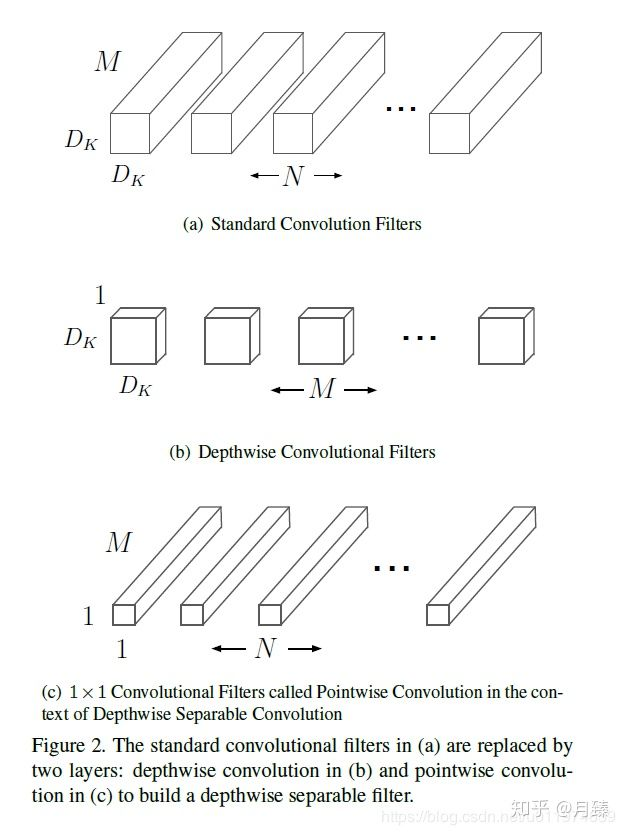
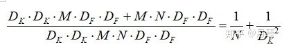
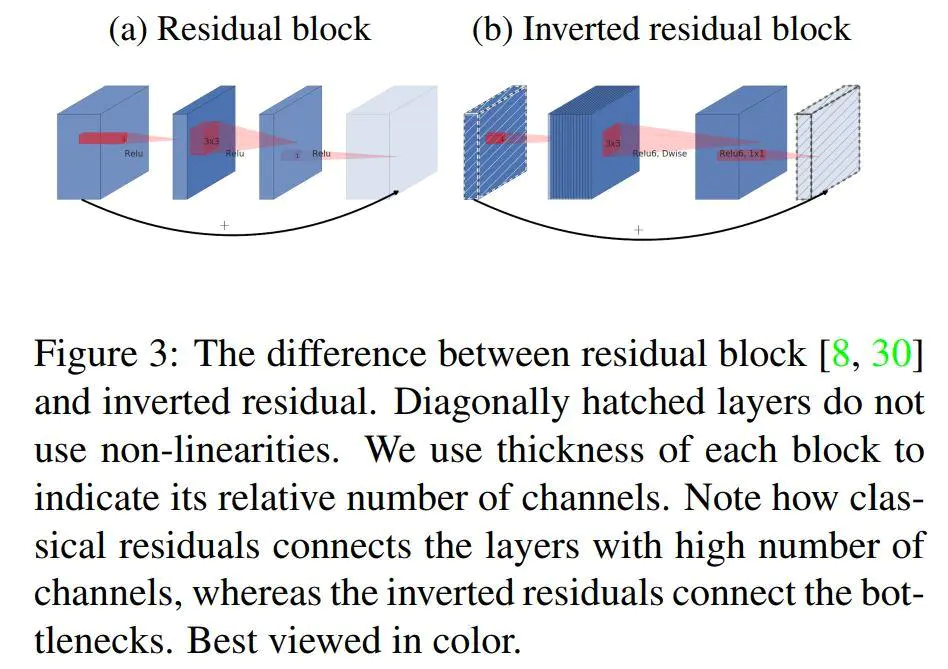
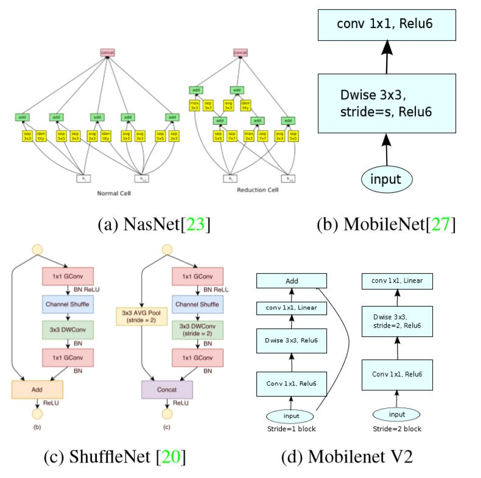
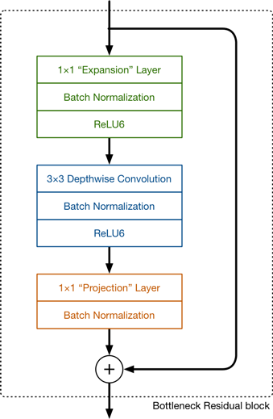
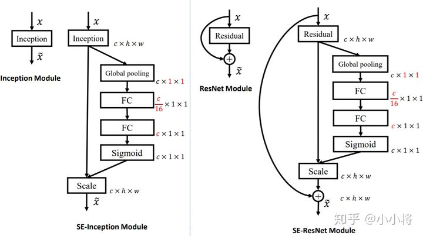
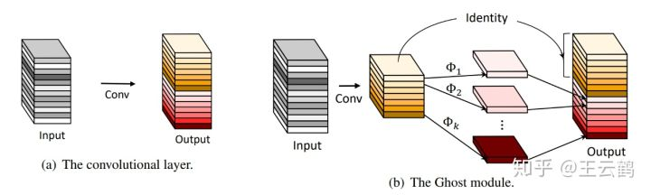
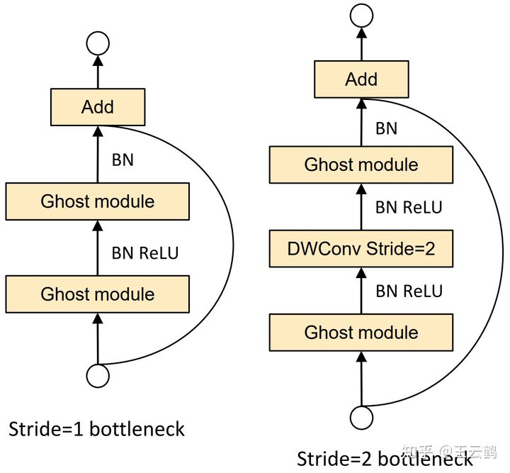

<!--
 * @Author: hedaobaishui 896585355@qq.com
 * @Date: 2022-04-11 15:15:56
 * @LastEditors: hedaobaishui 896585355@qq.com
 * @LastEditTime: 2022-07-11 11:07:36
 * @FilePath: /cavaface-master/home/magic/AKApractice/akaNotes/DL/3深度学习经典模型.md
 * @Description: 这是默认设置,请设置`customMade`, 打开koroFileHeader查看配置 进行设置: https://github.com/OBKoro1/koro1FileHeader/wiki/%E9%85%8D%E7%BD%AE
-->
<!-- TOC -->

- [1. 基础知识](#1-基础知识)
  - [1.0 Battleneck layer（瓶颈层）](#10-battleneck-layer瓶颈层)
  - [1.1Linear Bottleneck](#11linear-bottleneck)
  - [1.2 backbone](#12-backbone)
  - [1.3 timm](#13-timm)
- [2. 目标检测](#2-目标检测)
  - [2.1 one-stage](#21-one-stage)
    - [2.1.1 YOLO 家族](#211-yolo-家族)
      - [2.1.1.1 yolov1](#2111-yolov1)
      - [2.1.1.2 yolov2](#2112-yolov2)
      - [2.1.1.3 yolov3](#2113-yolov3)
      - [2.1.1.4 yolov4](#2114-yolov4)
      - [2.1.1.5 yolov5](#2115-yolov5)
      - [2.1.1.6 yoloX](#2116-yolox)
      - [2.1.1.7 TOOD](#2117-tood)
  - [2.2 two-stage](#22-two-stage)
- [3.　跟踪算法](#3跟踪算法)
- [2.deepsort((2022.4.27~2022.5.5))](#2deepsort2022427202255)
- [2.deepsort((2022.4.27~2022.5.5))](#2deepsort2022427202255-1)
- [4. 图像分割](#4-图像分割)
- [5. 6DOF](#5-6dof)
- [6. 点云](#6-点云)
- [7. SLAM](#7-slam)
- [8. GAN](#8-gan)
- [9. transform](#9-transform)
- [10. 轻量模型](#10-轻量模型)
  - [10.1 Mobilenet](#101-mobilenet)
    - [*v1*](#v1)
    - [*v2*](#v2)
    - [*v3*](#v3)
  - [10.2 ghostNet](#102-ghostnet)

<!-- /TOC -->
# 1. 基础知识
 ## 1.0 Battleneck layer（瓶颈层）
 Bottleneck layer又称之为瓶颈层，使用的是1*1的卷积神经网络。之所以称之为瓶颈层，是因为长得比较像一个瓶颈。
 我们看到，使用 **1X1** 的网络结构很方便改变维度。灵活设计网络，并且减小计算量
 
 ## 1.1Linear Bottleneck 
 来源　MobileNetV2
 使用的深度可分离卷积
 
 $$\mathcal{U}(-\sqrt{k}, \sqrt{k})$$
 ## 1.2 backbone
 ## 1.3 timm  
 ```Pytorch Image Models (timm) 整合了常用的models, layers, utilities, optimizers, schedulers, data-loaders / augmentations, and reference training / validation scripts，它的目的是将各种SOTA模型整合在一起，并具有再现ImageNet训练结果的能力。```
# 2. 目标检测
## 2.1 one-stage
### 2.1.1 YOLO 家族
#### 2.1.1.1 yolov1
#### 2.1.1.2 yolov2
#### 2.1.1.3 yolov3
* 锚框机制anchor是怎么用的：
训练过程

推理过程
根据锚框输出的置信度，判断该框是否使用，
* LOSS　计算
三个部分：坐标回归,是否是目标， 类别loss

#### 2.1.1.4 yolov4
#### 2.1.1.5 yolov5
#### 2.1.1.6 yoloX
#### 2.1.1.7 TOOD
## 2.2 two-stage
# 3.　跟踪算法
# 2.deepsort((2022.4.27~2022.5.5))
# 2.deepsort((2022.4.27~2022.5.5))
# 4. 图像分割
# 5. 6DOF
R 3*3 |R|= +1 R*Rt = E 单位正交矩阵　所有的三维旋转矩阵　组成一个群SO(3)
# 6. 点云
# 7. SLAM
# 8. GAN
# 9. transform

# 10. 轻量模型
## 10.1 Mobilenet
作者Google　大脑
###  *v1*
* 为什么：
深度分离网络　降低了计算量　1x1卷积核的优势　$\color{red}{im2col}$
* 怎么做的：
```
M是输入通道数，N是输出通道数 深度可分离网络　先拍扁再拉长
1．深度卷积：使用不同的卷积核对不同的通道分别卷积　
２．使用Ｍ*N的　1X1的卷积核深度卷积．
```

计算量

###  *v2*
* 为什么
  
  在神经网络中兴趣流行可以嵌入到低维子空间，通俗点说，我们查看的卷积层中所有单个d通道像素时，这些值中存在多种编码信息，兴趣流行位于其中的。我们可以通过变换，进一步嵌入到下一个低维子空间中(例如通过 [公式] 卷积变换维数，转换兴趣流行所在空间维度)。

  使用激活函数会使得兴趣流形坍塌不可避免的会丢失信息。

  我们知道，如果tensor维度越低，卷积层的乘法计算量就越小。那么如果整个网络都是低维的tensor，那么整体计算速度就会很快。

  然而，如果只是使用低维的tensor效果并不会好。如果卷积层的过滤器都是使用低维的tensor来提取特征的话，那么就没有办法提取到整体的足够多的信息。所以，如果提取特征数据的话，我们可能更希望有高维的tensor来做这个事情。V2就设计这样一个结构来达到平衡。先通过Expansion layer来扩展维度，之后在用深度可分离卷积来提取特征，之后使用Projection layer来压缩数据，让网络从新变小。因为Expansion layer 和 Projection layer都是有可以学习的参数，所以整个网络结构可以学习到如何更好的扩展数据和从新压缩数据。
* 怎么做的
```
1.相比v1 增加了残差模块.Inverted residuals
2.提出了使用linear bottleneck(即不使用ReLU激活，做了线性变换)的来代替原本的非线性激活变换.
3.Relu6

```




[参考](https://zhuanlan.zhihu.com/p/98874284)

###  *v3*
互补搜索技术组合
（1）资源受限的NAS（platform-aware NAS）：计算和参数量受限的前提下搜索网络的各个模块，所以称之为模块级的搜索（Block-wise Search）
（2）NetAdapt：用于对各个模块确定之后网络层的微调。
（3）对网络结构的改动　加入了SE(简单说就是增加了连接　提取了不同通道的特征重要性然后对其加权，在通道压缩squeeze过程中实现了通道信息传递)
模块

组卷积

## 10.2 ghostNet 
[参考连接](https://zhuanlan.zhihu.com/p/109325275) 

* 降低计算量：由于同一卷积层产生的的特征图具有相似性，通过生成的特征图　再构建另一部分特征图,之后再拼接．可降低s倍参数量


* 构建新的网络结构
  