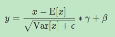
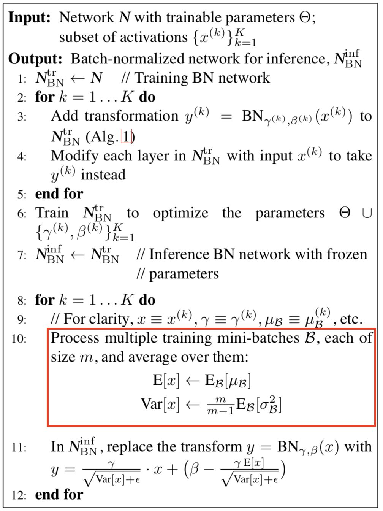

<!-- TOC -->

- [1. 基础知识](#1-基础知识)
  - [1.1. 计算量](#11-计算量)
  - [1.2. 参数量](#12-参数量)
- [2. １.卷积](#2-１卷积)
  - [2.0 torch.nn.conv2d()](#20-torchnnconv2d)
  - [2.1. dilated convolution\空洞卷积](#21-dilated-convolution空洞卷积)
  - [2.2. 分组卷积](#22-分组卷积)
  - [2.3. 深度可分离卷积](#23-深度可分离卷积)
  - [2.4. 卷积后的输出](#24-卷积后的输出)
  - [2.5. 卷积过程](#25-卷积过程)
  - [2.6 池化层](#26-池化层)
- [3. batchnormal](#3-batchnormal)
- [3. 激活函数](#3-激活函数)
- [4. LOSS 函数](#4-loss-函数)
- [5. 优化函数](#5-优化函数)
- [6. 学习率调整](#6-学习率调整)
- [7. batchNormal](#7-batchnormal)
- [8. 参数初始化](#8-参数初始化)
- [9. nn.Sequential](#9-nnsequential)
- [10. nn.Module](#10-nnmodule)
- [11. 逆卷积ConvTranspose2d!](#11-逆卷积convtranspose2d)
- [12. 逆卷积ConvTranspose2d!](#12-逆卷积convtranspose2d)
- [13. SyncBatchNorm](#13-syncbatchnorm)
- [TODO](#todo)
- [14. 卷积计算过程](#14-卷积计算过程)
- [15. 计算过程](#15-计算过程)
- [16. 不同的IOU](#16-不同的iou)
- [17. upsample pixelshuffle](#17-upsample-pixelshuffle)
- [18. 常见函数](#18-常见函数)
  - [torch.topk](#torchtopk)

<!-- /TOC -->
# 1. 基础知识
## 1.1. 计算量
参数量：
CNN:
一个卷积核的参数 = k*k*Cin+1
一个卷积层的参数 = (一个卷积核的参数)*卷积核数目=k*k*Cin*Cout+Cout

FLOPS:
注意全大写，是floating point operations per second的缩写，意指每秒浮点运算次数，理解为计算速度。是一个衡量硬件性能的指标。

FLOPs:
注意s小写，是floating point operations的缩写（s表复数），意指浮点运算数，理解为计算量。可以用来衡量算法/模型的复杂度。
$$ (2*C_{i}*K^2-1)*H*W*C_{0}$$
## 1.2. 参数量
一个卷积核的参数：
$$k*k*C_{in}$$
一个卷积层的参数：
$$k*k*C_{in}*C_{out}+C_{out}$$
# 2. １.卷积
## 2.0 torch.nn.conv2d()

* 参数：

特别的参数：
* stride(步长)：控制cross-correlation的步长，可以设为1个int型数或者一个(int, int)型的tuple。

* padding(补0)：控制zero-padding的数目。

* dilation(扩张)：控制kernel点（卷积核点）的间距; 也被称为 "à trous"算法. 空洞卷积
* bias 卷积后跟上　batchnormal 层时设置为false（不需要设置　没用　造成内存和计算浪费）
* 分组卷积：
At groups=1, all inputs are convolved to all outputs.
At groups=2, the operation becomes equivalent to having two conv layers side by side, each seeing half the input channels, and producing half the output channels, and both subsequently concatenated.
At groups=in_channels, each input channel is convolved with its own set of filters (of size ⌊out_channelsin_channels⌋
).

* 计算方式

## 2.1. dilated convolution\空洞卷积
* 1.用于图像分割
* 2.up-sampling 和 pooling layer 的设计缺陷   
* 3.asd  
## 2.2. 分组卷积
* Alex认为group conv的方式能够增加 filter之间的对角相关性,而且能够减少训练参数,不容易过拟合,这类似于正则的效果。
* 降低计算量:是普通卷积计算量1/group_nums
## 2.3. 深度可分离卷积
    *深度可分离卷积是MobileNet的精髓,它由deep_wise卷积和point_wise卷积两部分组成。而深度可分离卷积是进行了两次卷积操作,第一次先进行deep_wise卷积(即收集每一层的特征),kernel_size = K*K*1,第一次卷积总的参数量为K*K*Cin,第二次是为了得到Cout维度的输出,kernel_size = 1*1*Cin,第二次卷积总的参数量为1*1*Cin*Cout。第二次卷积输出即为深度可分离卷积的输出。      
    *分组卷积只进行一次卷积(一个nn.Conv2d即可实现),不同group的卷积结果concat即可
    *举个例子比较参数量：假设input.shape = [c1, H, W] output.shape = [c2, H, W] (a)常规卷积参数量=kernel_size * kernel_size * c1 * c2 (b)深度可分离卷积参数量=kernel_size * kernel_size *c1 + 1*1*c1*c2
## 2.4. 卷积后的输出
   * 卷积 从0开始计数　所以要加１
$$o=\frac{i+2p-k}{s}+1$$
   * 反向卷积
        i为输入尺寸，o为输出尺寸
      * 如果(o+2p-k)%s=0
        o = s(i-1)- 2p + k
      * 如果(o+2p-k)%s!=0
        o = s(i-1)- 2p + k + (o+2p-k)%s
## 2.5. 卷积过程
　卷积操作是低效操作，主流神经网络框架都是通过im2col+矩阵乘法实现卷积，以空间换效率。输入中每个卷积窗口内的元素被拉直成为单独一列，这样输入就被转换为了H_out * W_out列的矩阵(Columns)，im2col由此得名；将卷积核也拉成一列后(Kernel)，左乘输入矩阵，得到卷积结果(Output)。im2col和矩阵乘法见如下两图(图片来源：附录1)。

[数学推导](https://www.cnblogs.com/pinard/p/6494810.html)

asd [参考文献](https://www.jianshu.com/p/f743bd9041b3)    
## 2.6 池化层
nn.AdaptiveAvgPool2d　和nn.AvgPool2d() 模块
前者参数为输出的(H,W)根据输入自适应计算得到输出大小(HW)
后者根据输入参数 kernel,stride等计算得到输出
# 3. batchnormal

训练时，均值、方差分别是该批次内数据相应维度的均值与方差；
推理时，均值、方差是基于所有批次的期望计算所得，公式如下

# 3. 激活函数
self.relu = nn.ReLU(inplace=True) inplace 是够在原对象基础上进行修改
# 4. LOSS 函数
* the input :math:`x` and target :math:`y`.
* L1 LOSS
CrossEntropyLoss
$$\ell(x, y) = L = \{l_1,\dots,l_N\}^\top, \quad
        l_n = \left| x_n - y_n \right| $$
example:

        >>> loss = nn.L1Loss()
        >>> input = torch.randn(3, 5, requires_grad=True)
        >>> target = torch.randn(3, 5)
        >>> output = loss(input, target)
        >>> output.backward()
* NLLLoss
$$        \ell(x, y) = L = \{l_1,\dots,l_N\}^\top, \quad
        l_n = - w_{y_n} x_{n,y_n}, \quad
        w_{c} = \text{weight}[c] \cdot \mathbb{1}\{c \not= \text{ignore\_index}\}$$

$$
        \ell(x, y) = \begin{cases}
            \sum_{n=1}^N \frac{1}{\sum_{n=1}^N w_{y_n}} l_n, &
            \text{if reduction} = \text{'mean';}\\
            \sum_{n=1}^N l_n,  &
            \text{if reduction} = \text{'sum'.}
        \end{cases}
        $$
* 
$$        \ell(x, y) = L = \{l_1,\dots,l_N\}^\top, \quad
        l_n = - w_n \left[ y_n \cdot \log \sigma(x_n)
        + (1 - y_n) \cdot \log (1 - \sigma(x_n)) \right]$$
$$        \ell(x, y) = \begin{cases}
            \operatorname{mean}(L), & \text{if reduction} = \text{'mean';}\\
            \operatorname{sum}(L),  & \text{if reduction} = \text{'sum'.}
        \end{cases}
        $$
$$       \ell_c(x, y) = L_c = \{l_{1,c},\dots,l_{N,c}\}^\top, \quad
        l_{n,c} = - w_{n,c} \left[ p_c y_{n,c} \cdot \log \sigma(x_{n,c})
        + (1 - y_{n,c}) \cdot \log (1 - \sigma(x_{n,c})) \right]
        $$
# 5. 优化函数

# 6. 学习率调整

# 7. batchNormal
    nn.BatchNorm2d(num_features) num_featurs:输入数据的通道数量，在几个维度上计算
    解决了协方差漂移问题　２简单的正则化
    在卷积神经网络的卷积层之后总会添加BatchNorm2d进行数据的归一化处理，这使得数据在进行Relu之前不会因为数据过大而导致网络性能的不稳定，BatchNorm2d()函数数学原理如下：
    [其他的归一化方式](https://www.jianshu.com/p/913e4c08a638)
    BN：批量归一化，往batch方向做归一化，归一化维度是[N，H，W]
    

LN：层次归一化，往channel方向做归一化，归一化维度为[C，H，W]

IN：实例归一化，只在一个channel内做归一化，归一化维度为[H，W]

GN：介于LN和IN之间，在channel方向分group来做归一化，归一化的维度为[C//G , H, W]

SyncBatchNorm　动态　归一化层
# 8. 参数初始化
[参数初始化](https://blog.csdn.net/longrootchen/article/details/105650059)

# 9. nn.Sequential
    一个有序的容器，神经网络模块将按照在传入构造器的顺序依次被添加到计算图中执行，同时以神经网络模块为元素的有序字典也可以作为传入参数。
# 10. nn.Module 

是所有神经网络单元的基类
* nn.Module 是所有神经网络单元（neural network modules）的基类
* pytorch在nn.Module中，实现了__call__方法，而在__call__方法中调用了forward函数。
# 11. 逆卷积ConvTranspose2d!
# 12. 逆卷积ConvTranspose2d!
# 13. SyncBatchNorm
# TODO 
# 14. 卷积计算过程
# 15. 计算过程
# 16. 不同的IOU
 IoU、GIoU、DIoU 和 CIoU
 [参考](https://zhuanlan.zhihu.com/p/94799295)
# 17. upsample pixelshuffle
torch.nn.visionlayers
        #改变图像属性　亮度　对比度　饱和度　色调
        self.trancolor = transforms.ColorJitter(0.2, 0.2, 0.2, 0.05)

onehot.scatter_ 用于生成onehot 向量　[链接](https://blog.csdn.net/qq_39004117/article/details/95665418)
# 18. 常见函数
## torch.topk
   取一个tensor的topk元素（降序后的前k个大小的元素值及索引）dim=0表示按照列求 topn dim=1表示按照行求 topn 默认情况下，dim=1