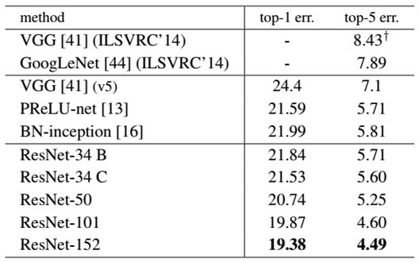

<!--
 * @Description: 
 * @Author: 
 * @Date: 2022-04-19 10:04:43
 * @LastEditTime: 2022-08-25 15:27:05
 * @LastEditors: hedaobaishui 896585355@qq.com
-->
# 前言
[TODOlist](https://editor.csdn.net/md?articleId=115220117)
第一步调整作息，生活习惯，养好精气神。
23:30 ~ 7:30　休息
8:30 ~ 21:00 工作
leetcode 
不敢挑战自己懦弱没出息
别人可以做到的你也可以　最起码不是最差的那一批中等水平还是有的哇
leetcode
6D姿态估计
SLAM
编程是一门技术活儿　需要多动手
算法是一门学术活儿　需要多看
纸上得来终觉浅　得知此事要躬行
身体是革命的本钱，合理健身\合理排解
１、总是什么都想做　然后什么都没做好
２．尽人事听天命
３. 好的坏的我都接受
４. 沉住气

 - [x] 身体　健康的作息 
 - [x] 小样本检测
 - [ ] 3、AUTO ML YOLOV4 & V5 
 - [ ] List item
 - [ ] 4、目标跟踪 deep sort
 - [ ] 23、网络加速：网络结构优化、动态剪枝、量化
 - [ ] 1、KMP 算法 get
 - [ ] 命名规则
 - [ ] 3、AUTO ML YOLOV4 & V5 
 - [ ] 4、目标跟踪 deep sort
 - [ ] 5、图割
 - [ ] 6、刷题 到5月15日 300道题 100简单 100中等 100难
 - [ ] 8、读论文每周2篇
 - [ ] 9、直播特效（本地视频采集 特效处理 显示）
 - [ ] 10、模型量化压缩
 - [ ] 11、人体姿态估计
 - [ ] 12、强化学习
 - [ ] 13、OCR
 - [ ] 14、人脸识别
 - [ ] 15、torch 源码 反向传播
 - [ ] 16、学习图像增强 imgaug、albumentation源码
 - [ ] 17、学习一种代码解释器
 - [ ] 18、模型是如何转换的 NCNN RKNN
 - [ ] 19、混淆矩阵
 - [ ] 20、哈希表
 - [ ] 21、super() 是用来解决多重继承问题的，直接用类名调用父类方法在使用单继承的时候没问题，但是如果使用多继承，会涉及到查找顺序（MRO）、重复调用（钻石继承）等种种问题。
 - [ ] 22、 模板类
 - [ ] 23、网络加速：网络结构优化、动态剪枝、量化
 - [ ] 23-2、在卷积神经网络加速方面的近期研究工作可分为三大类，即：低秩分解、参数量化和网络剪枝
 - [ ] 24、CV&ML领域扎实的基础理论
 - [ ] 25、高效的论文阅读及原型实现能力
 - [ ] 26、深度学习框架
 - [ ] 27、网络加速
 - [ ] 28、git 学习
 - [ ] 29、良好的编程习惯
 - [ ] 30、paper and book
 - [ ] 31、视频特效 人头 姿态
 - [ ] 32 计算机视觉 检测 分割 GAN 排行榜！https://paperswithcode.com/sota
 - [ ] 33 Transformer
 - [ ] 34 快速判别文献是否能够解决自己的问题
 - [ ] 35 模型性能优化
 - [ ] 36 python 学习
 - [ ] 37 leetcode
 - [ ] 38 transform 在图像检测识别中的应用
 - [ ] 39 yolov5 源码学习
 - [ ] 40 医学检测、OCR检测 学习
 - [ ] 41 DCN 网络
 - [ ] 42 codebook特征编码 模型压缩
 - [ ] 43 KD 树
 - [ ] 44 软考信息系统项目管理师
 - [ ] 45 NEROIC,NeRF-Pose: A First-Reconstruct-Then-Regress Approach for Weakly-supervised 6D Object Pose Estimation
 - [ ] 46 RSTT transformer
 - [ ] 47 空洞卷积
 - [ ] 48 logging
 - [ ] 49 argparse
 - [ ] 50 重新训练幼虫识别模型 使用label smoothing
 - [ ] 51 绘制 loss 曲线
 - [ ] 52 auto AI
 - [ ] 53 cache 技术
 - [ ] 54 手势姿态识别
 - [ ] 55 6DOF
 - [ ] 56 人体姿态估计、关键点估计
 - [ ] 57 时序\video　解析
 - [ ] 58 人脸检测 [参考链接](https://www.infoq.cn/article/CfW4lObDUR-Oiw5PUcru)
 - [ ] 59　视频流美颜处理Aliface 人脸关键点检测　GPU 和CPU的占用率　模型裁剪降低计算法复杂度　Github:TengineKit
 - [ ] 60 视频流解析　各种编码格式视频间的转换　
 - [ ] 61 多传感器特征融合　联合判决
 - [x] 61 内存参数分析[参考网址](https://blog.csdn.net/wz22881916/article/details/81054036)
 - [ ] 62 自动驾驶技术数据集[参考网址](https://zhuanlan.zhihu.com/p/159684396)
 - [ ] 64 模型加密　[参考网址](https://zhuanlan.zhihu.com/p/268327784)
 - [ ] 65 pytorch模型加密[参考网址](https://blog.csdn.net/weixin_43508499/article/details/124390983)
 - [ ] 66 android 简单开发
 - [ ] 67 边缘计算 
 - [ ] docker
 - [ ] MTCNN
 - [ ] 人脸特效
 - [ ] 自学习　自监督学习
 - [ ] XGboost LightGBM
 - [ ] transformer swin 
 - [ ] SLAM 导航与定位
 - [ ] 人体关键点检测
 - [ ] 手指关键点检测
 - [ ] RT 矩阵计算
 - [ ] python 和c++ 绑定
 - [ ] 合成深度样本
 - [ ] 视频帧间的目标跟踪YCB数据集　meanshift算法
 - [ ] 奇异值分解求解RT [链接](https://blog.csdn.net/dfdfdsfdfdfdf/article/details/53213240)
 - [ ] 人脸识别　人脸检测　眨眼检测　活体检测　门禁的人脸识别系统[产考链接](https://zhuanlan.zhihu.com/p/105810423)
 - [ ] asd
 - [ ] KDtree
 - [ ] open3d
 - [ ] 长尾效应
 - [ ] 知识蒸馏　迁移学习　教师网络->学生网络　模型压缩
 - [ ] MTCNN 人脸检测
 - [ ] deepfake [参考网址](https://zhuanlan.zhihu.com/p/139489768)
 - [ ] 手撕NMS
 - [ ] 轻量化网络
 - [ ] 
 - [ ] 字符识别
 - [ ] {'quicksort', 'mergesort', 'heapsort', 'stable'},
 - [ ] 提高编程能力的书籍　视频
 - [ ] 提高管理能力　语言能力　逻辑思维能力　专注力　记忆力　幸福感　获得感　去除空虚感的方法
 - [ ] .pyx
 - [ ] git 学习[链接](https://zhuanlan.zhihu.com/p/276376558)
 - [ ] docker 学习
 - [ ] YUV RGB
 - [ ] 打通　从图像采集到结果输出的全流程　最好能加UI
 - [ ] 多机编程　使用多块GPU 训练模型
 - [ ] 图像增强
 - [ ] zero-shot、few-shot
 - [ ] 轻量模型resnet101 top-5error 6
  
 - [ ] 模型计算量[链接](https://blog.csdn.net/weixin_39833897/article/details/105807172)
 - [ ] torchshard　模型参数切片
 - [ ] 模型压缩
 - [ ] transfer learning 迁移学习
 - [ ] 基础知识 and 面经
 - [ ] 量化投资
 - [ ] 矩阵计算过程　内存问题 im2col
 - [ ] 稀疏矩阵
 - [ ] 奇异值分解
 - [ ] 矩阵的　axis 和　dim
 - [ ] 查看模型存储
 - [ ] python collections
 - [ ] super 顺序的影响
 - [ ] python 高级编程
 - [ ] C-GHOSTNETS (https://arxiv.org/pdf/2201.03297.pdf)
 - [ ] 网络可视化工具netron
 - [ ] 网络
 - [ ] C++ 
 - [ ] shell
 - [ ] 操作系统
 - [ ] NAS
 - [ ] 模型的计算量
 - [ ] 视频中目标跟踪
 - [ ] 流媒体处理
 - [ ] gstreamer