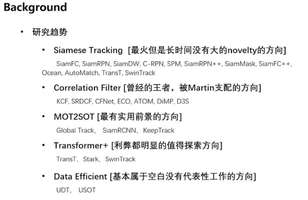
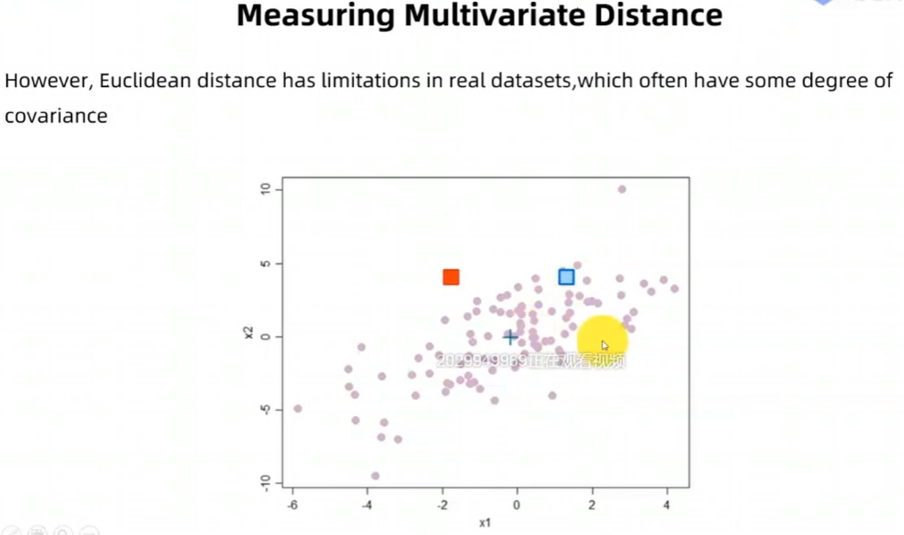
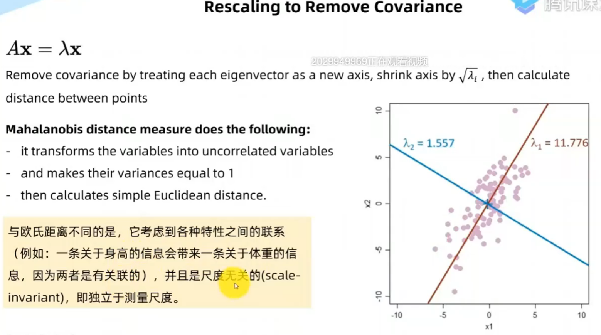
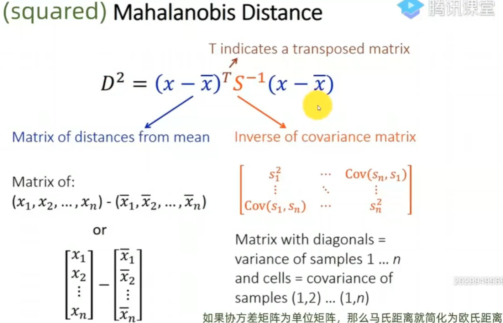
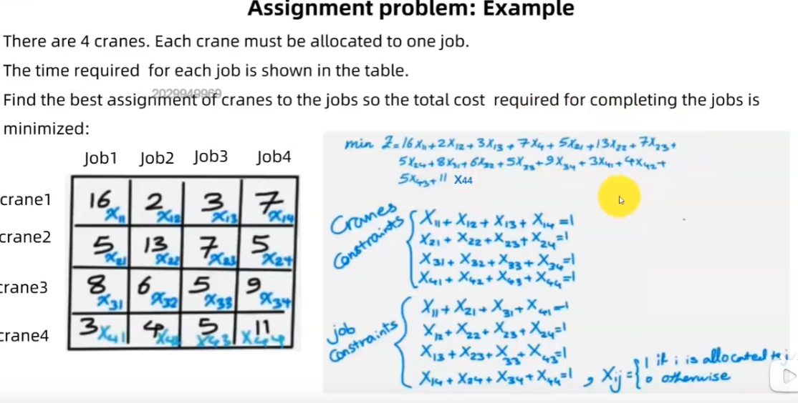

<!--
 * @Author: hedaobaishui 896585355@qq.com
 * @Date: 2022-09-06 13:30:24
 * @LastEditors: hedaobaishui 896585355@qq.com
 * @LastEditTime: 2022-09-06 16:05:31
 * @FilePath: /2021_9_23/home/magic/AKApractice/akaNotes/Tracking/目标跟踪.md
 * @Description: 这是默认设置,请设置`customMade`, 打开koroFileHeader查看配置 进行设置: https://github.com/OBKoro1/koro1FileHeader/wiki/%E9%85%8D%E7%BD%AE
-->
<!-- TOC -->

- [1. 研究进展　--2022](#1-研究进展--2022)
- [2. deep sort (2017年)](#2-deep-sort-2017年)

<!-- /TOC -->
# 1. 研究进展　--2022
　
# 2. deep sort (2017年)
* 马氏距离  
 应对高维线性分布的数据中各维度间非独立同分布的问题。  
 

* 匈牙利算法　－－分配问题/指派问题
  - 步骤  
    1.每行减去每行对应的最小值
    2.每列减去每列对应的最小值
    3.用最少的线段数覆盖包含零的行列　如果线数等于行数跳到６  
    4.找到未覆盖的数的最小值m　然后减去该值，3中线的交叉点的值加上m
    5.跳到3
    6．安排任务　从行/列包含最少的0的开始分派任务
  

[匈牙利算法](https://www.bilibili.com/video/BV1FB4y157uK?p=13&vd_source=07cc9345d5275ba258ccb6a3ad5d06eb&t=251.6)
参考地址：
http://giantpandacv.com/academic/%E7%9B%AE%E6%A0%87%E6%A3%80%E6%B5%8B%E5%8F%8A%E8%B7%9F%E8%B8%AA/%E7%9B%AE%E6%A0%87%E8%B7%9F%E8%B8%AA/DeepSORT%E7%AE%97%E6%B3%95%E4%BB%A3%E7%A0%81%E8%A7%A3%E6%9E%90%28%E5%85%A8%29/#6
https://zhuanlan.zhihu.com/p/148516834
